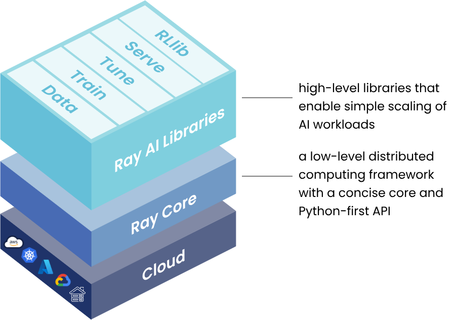
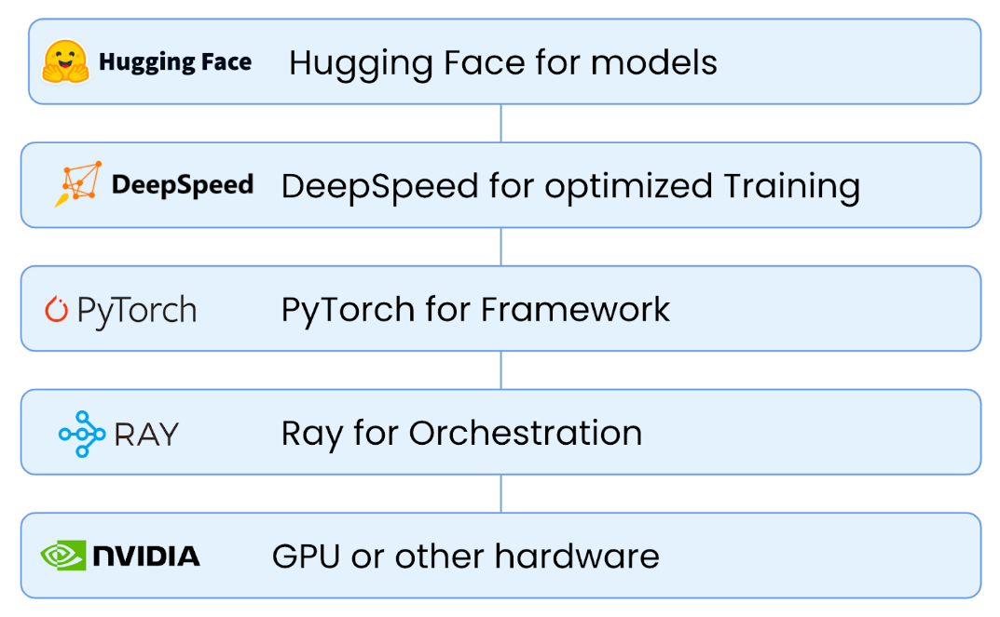
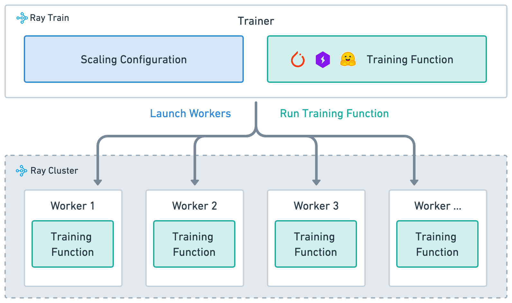

# Tutorial for Ray
This tutorial demonstrates how to use Ray for distributed machine learning, specifically focusing on fine-tuning Large Language Models using Ray Train.

## What is Ray?
### Overview
Ray is an open-source unified compute frameowkr that makes it easy to scale AI and Python workloads. Unlike frameowkrs that are purely for training (like PyTorch Distributed) or purely for data processing (like Spark), Ray provides a general-purpose cluster-computing layer that supports a heterogeneous ecosystem of libraries.

At a high level, Ray solves the problems of scalability and cluster management for Python applications by abstracting away the infrastructure.



#### Use cases: LLMs and Gen AI
For scaling ML, Ray provides a distributed compute framework for scaling models, allowing developers to train and deploy models faster and more efficiently.
- Data streaming
- Training
- Fine-tuning
- Serving



### Ray Core
Ray Core is the low-level distributed computing API. It provides the universal primitives that allow you to take existing Python code and distribute it across a cluster with minimal changes.

#### Task (Stateless)
Tasks are remote functions. When you call a function decorated with `@ray.remote`, Ray executes it asynchronously on a worker process. A return value of tasks is `ObjectRef` due to the asynchronous execution. Tasks are scheduleed dynamically and Ray scheduler tries to maximize locality.

See `examples/process.py` and `examples/parallel_process.py`.

#### Actor (Stateful)
Actors are remote classes. They are essentially stateful workers (services) that persist in memory.
- Use case: holding model weights, simulators, or database connections.
- Scheduling: Actors are scheduled once and reserve resources for their lifetime.

See `examples/counter.py` and `examples/counter_ray.py`.

### Ray Train
Ray Train is a library built on top of Ray Core designed specifically for distributed model training (PyTorch, XGBoost, TensorFlow, or etc.). It abstracts away the complexity of setting up distributed training envinronments, such as `torch.distributed`.

- Training function: A Python function that contains your model training logic.
- Worker (actor): A process that runs training function.
- Scaling configuration: A configuration of the nubmer of workers and compute resources (e.g., CPUs or GPUs).
- Trainer: A Python class that ties together the training function, workers, and scaling configuration to execute a distributed training job.



## Setup environment
### Prerequisites
- Install [uv](https://docs.astral.sh/uv/getting-started/installation/), which is a substitute for `pip`

### Installation
1. Clone a git repository:
```bash
git clone XXX
```

2. Create a virtual environment:
```bash
uv venv 
```
`uv` creates a virtual environment bsased on `pyproject.toml`.

3. Activate the virtual environment:
```bash
source .venv/bin/activate 
```

4. Sync required libraries and frameworks:
```bash
uv sync
```
This installs Ray with ML dependencies, PyTorch, transformers, and other required packages. See `pyproject.toml` for the complete list.

## Training (Fine-tuning)
### Dataset
The tutorial uses a Rust programming language dataset for fine-tuning. The used dataset is:
- `data/rust` in [bigcode/the-stack-smol](https://huggingface.co/datasets/bigcode/the-stack-smol)

### Running the training script
1. Initialize Ray cluster (local mode):
```bash
ray start --head
```
This is not necessary but it is good to run at the background, keeping a monitoring application alive.

2. Run the fine-tuning script:
```bash
python train_llm.py

# Or, 
RAY_API_SERVER_ADDRESS='http://127.0.0.1:8265' ray job submit --working-dir . -- python train_llm.py
```

3. Monitor training progress:
```bash
# Access at http://localhost:8265
```

### Configuration
`config.py` defines parameters that can be used for training. Use them appropriately.

#### Training Parameters
- `model_name`: Pre-trained model to fine-tune (e.g., "gpt2", "codegen-350M")
- `batch_size`: Training batch size per worker (default: 8)
- `learning_rate`: Optimizer learning rate (default: 5e-5)
- `num_epochs`: Number of training epochs (default: 3)
- `storage_path`: Path to store checkpoints and logs (default: "./results")
- `TBD`

#### Ray Configuration
- `num_workers`: Number of distributed training workers (default: 2)
- `use_gpu`: Whether to use GPU for training (default: True) 
- `resources_per_worker`: Resources allocated per worker
  - `CPU`: Number of CPUs per worker (default: 2)
  - `GPU`: Number of GPUs per worker (default: 1)
- `TBD`


### Dissecting a training script: `train_llm.py`
#### The orchestrator: `TorchTrainer`
```python
trainer = TorchTrainer(
    train_loop_per_worker=train_loop,     # The function to run on every worker
    train_loop_config=train_loop_config,  # Parameters for the actual training
    scaling_config=scaling_config,        # Hardware resource definition
    run_config=run_config,                # Storage and naming
)
```

TorchTrainer is a wrapped trainer for data parallel PyTorch training. It allocates resources, spawns worker processes, and sets up the communication backend (backend usually defaults to `nccl` for GPUs).

- `ScalingConfig`: defines the physical cluster topology. It specifies how many workers (`num_workers`) to launch and whether to use GPUs (`use_gpu=True`)
- `RunConfig`: manages experiment metadata. It defines where logs and checkpoints are stored (`storage_path`) and names the experiment for tracking.

#### The worker logic: `train_loop`
```python
def train_loop(config: Dict[str, Any]) -> None:
    # 1] Setup a dataloader 
    # 2] Setup a model
    # 2-1] Load an exisiting checkpoint if available
    # 3] Define an optimizer
    # 4] Execute the actual training for loop
```
The function is the core logic executed independently on every worker node. Ray Train injects the necessary environment variables so these workers can communicate.

##### Model & data preparation
Loading a model and dataset utilizes PyTorch and Hugging Face APIs.
```python
# Load a model
model = AutoModelForCausalLM.from_pretrained(config["model_name"])

# Load a dataset
dataset = load_dataset(dataset_name, split="train[:1%]", download_config=DownloadConfig(disable_tqdm=True))
```

Ray provides helper utilities to automatically wrap native PyTorch objects for distributed execution:
- `ray.train.torch.prepare_model(model)`: This wraps your standard Hugging Face `AutoModel` with `DistributedDataParallel` (DDP).
- `ray.train.torch.prepare_data_loader(data_loader)`: This injects a `DistributedSampler` into your dataloader. It ensures that each worker processes a unique shard of the dataset.

#### Checkpointing & reporting
##### Store a checkpoint
```python
def report_metrics_and_save_checkpoint(
    model: torch.nn.Module,
    metrics: Dict[str, Any]
) -> None:
    ...
    if rank == 0:
        checkpoint_dir = os.path.join(tmp_dir, "checkpoint")
        os.makedirs(checkpoint_dir, exist_ok=True)

        model_state = model.module.state_dict() if hasattr(model, 'module') else model.state_dict()
        torch.save(model_state, os.path.join(checkpoint_dir, "model.pt"))

        epoch_file = os.path.join(checkpoint_dir, "epoch.txt")
        with open(epoch_file, "w") as f:
            f.write(str(epoch_value))
    ...
```
In distributed training, you typically only want one worker (Rank 0) to write files to disk to avoid write conflicts.
- If Rank 0, dumps the model state (`model.pt`) and epoch info to a local temp directory.
- If Rank > 0, does nothing regarding file I/O.

##### Log
```python
def report_metrics_and_save_checkpoint(
    model: torch.nn.Module,
    metrics: Dict[str, Any]
) -> None:
    ...
    # metrics: {"loss": running_loss / num_batches, "epoch": epoch}
    ray.train.report(metrics, checkpoint=checkpoint)
    ...
```
`report` API is a collective operation:
- It sends metrics to the Ray dashboard.
- It transfers the `checkpoint` object to the shared location (e.g., S3)
- It ensures all workers are synchronized before proceeding to the next step.

#### Summary flowchart
1. Driver: TorchTrainer.fit() starts.
2. Ray: Allocates resources (e.g., 4 GPUs) and starts 4 Worker Actors.
3. Workers:
    - Load dataset -> prepare_data_loader (Shard data).
    - Load model -> prepare_model (Wrap in DDP).
    - Loop:
        1. Forward Pass -> Backward Pass -> Optimizer Step (DDP syncs gradients here).
        2. End of Epoch:
            - Rank 0 saves model to disk.
            - All Ranks call ray.train.report.

4. Ray: Updates Dashboard with loss metrics and registers the new checkpoint.

### Advanced features
#### Fine-tuning using LoRA


## Resources
- [Get Started with Distributed Training using PyTorch](https://docs.ray.io/en/latest/train/getting-started-pytorch.html)
- [Fine-tune an LLM with Ray Train and DeepSpeed](https://docs.ray.io/en/latest/train/examples/pytorch/deepspeed_finetune/README.html)
- [Last Mile Data Processing with Ray](https://medium.com/pinterest-engineering/last-mile-data-processing-with-ray-629affbf34ff)
- [Ray for Fault-Tolerant Distributed LLM Fine-Tuning](https://latitude-blog.ghost.io/blog/ray-for-fault-tolerant-distributed-llm-fine-tuning/)
- [Ray Explained: From a Slow Function to a Scalable Service in 40 Minutes](https://github.com/The-Pocket/PocketFlow-Tutorial-Video-Generator/blob/main/docs/system/ray.md)