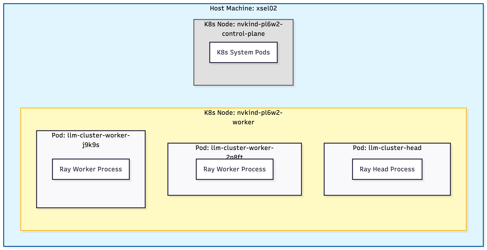
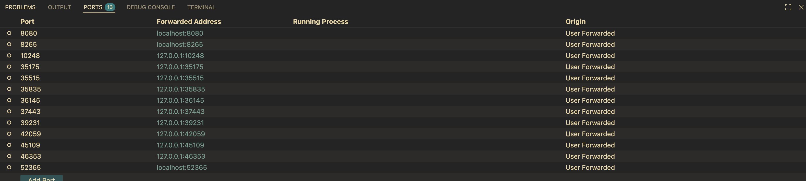

# KubeRay Tutorial

## Current architecutre


## Setup Ray Cluster

The cluster is already running on our lab server `xsel02`. Therefore, setting is not necessary at this point. You might need the below commands to build a cluster from scratch.

**Step 1: Create containers**

This creates a default cluster with 1 worker node with access to all GPUs on the machine. To use GPUs, we use [nvkind](https://github.com/NVIDIA/nvkind)

```shell
nvkind cluster create
```
 
**Step 2: Check your clusters**

```shell
nvkind cluster list
nvkind-pl6w2
```

Print the set of GPUs available on all nodes of a cluster (include a `--name` flag to select a specific cluster, or omit it to run against the current kubecontext):

```shell
nvkind cluster print-gpus
[
    {
        "node": "nvkind-pl6w2-worker",
        "gpus": [
            {
                "Index": "0",
                "Name": "NVIDIA RTX A6000",
                "UUID": "GPU-f4ee8509-da2f-ccf7-1753-02f1eeba984c"
            },
            {
                "Index": "1",
                "Name": "NVIDIA RTX A6000",
                "UUID": "GPU-19fc8822-85b5-4cc4-1327-b68b57f7691d"
            }
        ]
    }
]
```

**Step 3: Launch KubeRay operator**

A operator connects a Ray cluster and k8s containers.

**Step 3-1: Add the kuberay repo (this can be skipped b/c already done)**

```shell
helm repo add kuberay https://ray-project.github.io/kuberay-helm/
helm repo update
```

**Step 3-2: Install both CRDs and KubeRay operator**

```shell
helm install kuberay-operator kuberay/kuberay-operator --version 1.5.1
```

**Step 3-3: Validate installation**

```shell
kubectl get pods

NAME                                READY   STATUS    RESTARTS   AGE
kuberay-operator-6bc45dd644-gwtqv   1/1     Running   0          24s
```

**Step 4: Launch GPU operator**

The GPU Operator allows administrators of Kubernetes clusters to manage GPU nodes just like CPU nodes in the cluster.

**Step 4-1: Add the NVIDIA Helm repository**  

```shell
helm repo add nvidia https://helm.ngc.nvidia.com/nvidia \
    && helm repo update
```

**Step 4-2: Deploy GPU Operator**

```shell
helm install --wait --generate-name \
    -n gpu-operator --create-namespace \
    nvidia/gpu-operator
```

After installation, the GPU Operator and its operands should be up and running. This takes a while (around 5-10 mins).

**Step 5: Setup ray pods**

**Step 5-0: Input a HF token & build pods**

Before executing the build cmd, please edit `ray-cluster.yaml` and put your huggingface secret token.

```
vim ray-cluster.yaml

apiVersion: v1
kind: Secret
metadata:
  name: hf-token
type: Opaque
stringData:
  hf_token: <your token>
```

and then execute the following cmd

```shell
kubectl apply -f ray-cluster.yaml
```

**Step 5-1: Check the running pods**

Please make sure your cluster is `READY 1/1`. This indicates your pods are initialized w/o errors.

```shell
kubectl get pods

NAME                                   READY   STATUS    RESTARTS   AGE
kuberay-operator-648fdf69cb-4wpkt      1/1     Running   0          2d22h
llm-cluster-gpu-workers-worker-2n8ft   1/1     Running   0          47h
llm-cluster-gpu-workers-worker-j9k9s   1/1     Running   0          47h
llm-cluster-head-v29mn                 1/1     Running   0          47h

kubectl get pods -o wide # you can see what container is used
NAME                                   READY   STATUS    RESTARTS   AGE     IP            NODE                  NOMINATED NODE   READINESS GATES
kuberay-operator-648fdf69cb-4wpkt      1/1     Running   0          2d22h   10.244.1.11   nvkind-pl6w2-worker   <none>           <none>
llm-cluster-gpu-workers-worker-2n8ft   1/1     Running   0          47h     10.244.1.45   nvkind-pl6w2-worker   <none>           <none>
llm-cluster-gpu-workers-worker-j9k9s   1/1     Running   0          47h     10.244.1.46   nvkind-pl6w2-worker   <none>           <none>
llm-cluster-head-v29mn                 1/1     Running   0          47h     10.244.1.44   nvkind-pl6w2-worker   <none>           <none>
```

**Step 5-2 (optional): Check the running node (Kubernetes containers)**

```shell
kubectl get node

NAME                         STATUS   ROLES           AGE     VERSION
nvkind-pl6w2-control-plane   Ready    control-plane   2d22h   v1.35.0
nvkind-pl6w2-worker          Ready    <none>          2d22h   v1.35.0
```

**Step 5-3 (optional): Retrieve verbose information about k8s resources**

```shell
kubectl describe node

Name:               nvkind-pl6w2-control-plane
Roles:              control-plane
Labels:             beta.kubernetes.io/arch=amd64
                    beta.kubernetes.io/os=linux
...
```

## Submit  a Ray training job

**Step 1: Access to the head node**

```shell
kubectl exec --stdin --tty <your-head-node> -- /bin/bash
or
kubectl exec -i -t <your-head-node> -- /bin/bash

# Our case
kubectl exec --stdin --tty llm-cluster-head-v29mn -- /bin/bash
```

**Step 2: Copy pyproject.toml**

This command should be executed inside **the head node**

```shell
pwd
/home/ray

ls
anaconda3  pip-freeze.txt  rayllm_py311_cu128.lock  requirements_compiled.txt  training  workspace

cp training/pyproject.toml workspace/
```

**Step 3: Run a training script**

```shell
ray job submit --runtime-env-json '{"working_dir": ".", "py_executable": "uv run"}' -- uv run src/train_llm.py

Job submission server address: http://10.244.1.44:8265
2026-01-17 17:48:23,225 INFO dashboard_sdk.py:355 -- Uploading package gcs://_ray_pkg_3383f23f6a634a99.zip.
2026-01-17 17:48:23,225 INFO packaging.py:588 -- Creating a file package for local module '.'.
```

I am using `uv` to easily install any dependency across pods (e.g., workers). I will update the details soon.

- https://www.anyscale.com/blog/uv-ray-pain-free-python-dependencies-in-clusters

**Step 4: check the training or pod status via port-foward**

```shell
kubectl port-forward <your-head-node> 8265:8265

# Our case
kubectl port-forward svc/llm-cluster-head-svc 8265:8265
```

If you use VS Code, you can simply see the Ray dashboard via port-fowarding. See the screenshot below:



**(Optional): Copy files or directories from the local to the pod**

```shell
kubectl cp <file or dir> <head-node>:/home/ray/
```

## Checkpoints

Our cluster has a local storage built by `PVC`, which stands for PermanentVolumeClaim. This storage is shared across the head and worker nodes in `/mnt/shared`. The information can be found in `ray-cluster.yaml`

```shell
apiVersion: v1
kind: PersistentVolumeClaim
metadata:
  name: ray-checkpoints-pvc
  namespace: default
spec:
  storageClassName: standard
  accessModes:
    - ReadWriteOnce  # Rank 0 only - local-path provisioner supports this
  resources:
    requests:
      storage: 100Gi
```

## Serving (TBD)

**Step 1: launch a script**

```shell
serve build llm-serve.yaml
```

This is currently not working due to a random error in vLLM. Will be fixed.

##  Termination

**Step 1: Clean Ray pods**

```shell
kubectl delete raycluster llm-cluster 
```

- `raycluster`: CRD (Custom Resource Definition) in k8s
- `llm-cluster`:  a Ray cluster name defined in a yaml file

**Step 2: Clean k8s containers**

```shell
for cluster in $(kind get clusters); do kind delete cluster --name=${cluster}; done
```

## Inside the head node

```shell
$HOME = /home/ray
$TMP = /tmp/ray (This variable is not actually set)
```

## Trouble-shooting
### GPUs seem not available

```shell
VERSION:
   1.18.1
commit: efe99418ef87500dbe059cadc9ab418b2815b9d5
```


Docker originally does not configure GPU environment.

```bash
message: 
'Deployment ''LLMServer:qwen2_5-7b-instruct'' in application
''llms'' has 1 replicas that have taken more than 30s to be scheduled. This may be due to waiting for the cluster to auto-scale or for a runtime environment to be installed. Resources required for each replica: [{"CPU": 1.0, "GPU": 1.0}], total resources available: {}. Use `ray status` for more details.'
```

Check your available resource:

```bash
kubectl get nodes -o json | grep -A 10 "allocatable"

"**allocatable**": 
{
	"cpu": "48",
	"ephemeral-storage": "225956404Ki",
	"hugepages-1Gi": "0",
	"hugepages-2Mi": "0",
	"memory": "131758472Ki",
	"pods": "110"
},
```

If there is available GPU resource, but they are not seen in the result, your cluster nodes do not have the NVIDI GPU device plugin installed. Kubernetes does not automatically detect GPUs; therefore, you need to install the NVIDIA device plugin to make GPUs available as `nvidia.com/gpu` resource.


_Tags for Search: #ray #tutorial